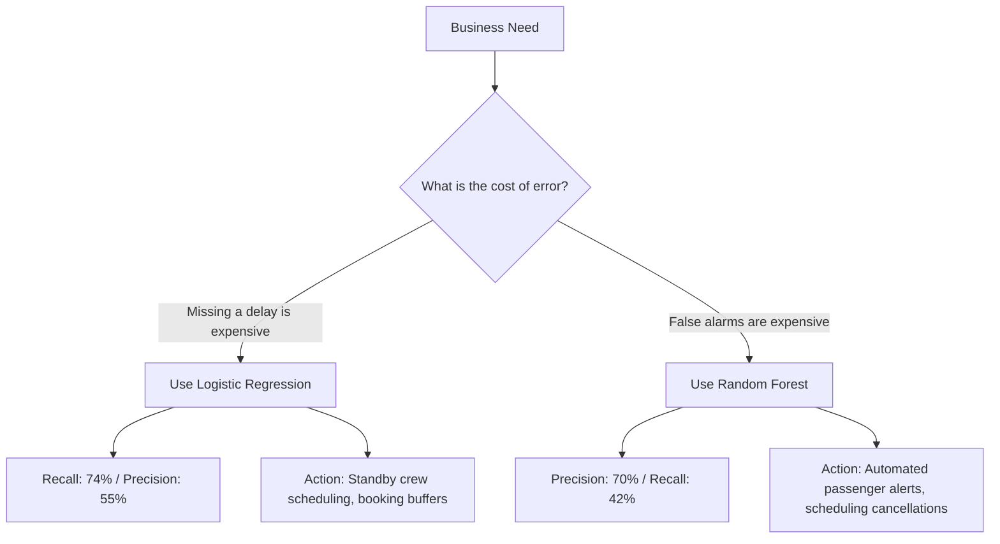

# Portfolio Case Study: Flight Delay Predictor & Analytics Dashboard

A comprehensive overview of a complete, end-to-end data mining and machine learning project. This document compiles the core methodologies, exploratory data analysis (EDA), statistical testing, feature engineering, pipeline construction, model evaluation, and dashboard deployment.

---

## 1. Project Overview & Business Case

### The Problem
Flight delays cost airlines and airport authorities billions of dollars annually in operational disruption, crew rescheduling, fuel waste, and passenger compensation. For passengers, delays represent lost productivity and missed connections.

### The Objective
To build an analytical dashboard and predictive machine learning service that helps operational managers (airlines/airports) and travelers anticipate high-risk periods and make data-driven scheduling decisions.

### Target Engineering (The Analytical Pivot)
* **Initial Approach:** Predict individual flight delay duration (in minutes) or individual flight delay status (binary: delayed or not).
* **The Problem:** Individual flight-level data is highly chaotic, influenced by random factors (late baggage, minor maintenance, gate issues) that create massive noise and low signal-to-noise ratio.
* **The Solution (Target Engineering):** Shift the prediction target to a month-level, carrier-airport route aggregate. We define the target variable `high_delay` (binary) as:
  $$\text{high\_delay} = \begin{cases} 1, & \text{if } \ge 20\% \text{ of arriving flights for that carrier-airport pair were delayed } \ge 15 \text{ mins} \\ 0, & \text{otherwise} \end{cases}$$
  This aggregates chaotic micro-variability into a stable operational risk index suitable for scheduling decisions.

---

## 2. Exploratory Data Analysis (EDA) & Statistical Hypothesis Testing
*Notebook reference: `notebooks/Flight_Delay_Prediction.ipynb`*

We analyzed a flight dataset containing **98,619 individual flight records** to test hypotheses about the drivers of flight delays.

### A. General Delay Baseline
* **Total Flights:** 98,619
* **Delayed Flights:** 32,831 (**33.29%**)
* **On-Time Flights:** 32,846 (**33.31%**)
* **Cancelled Flights:** 32,942 (**33.40%**)
* *Note: The dataset was highly balanced across statuses, providing an ideal baseline for classification analysis.*

### B. Statistical Hypothesis Testing
To isolate true predictors from random noise, we performed rigorous statistical testing:

| Hypothesis Tested | Statistical Test | Outcome | Operational Conclusion |
| :--- | :--- | :--- | :--- |
| **Do specific pilots cause more delays?** | Coefficient of Variation & Std. Dev. of pilot delay rates | Mean delay rate: ~33.22%, Std. Dev.: ~0.02%. p-value > 0.05. | **No correlation.** Pilot assignments do not affect delay probability. |
| **Does passenger age correlate with delays?** | Pearson & Spearman Correlation ($r$) | $r \approx 0.00$ (p-value > 0.05) | **No correlation.** Passenger demographic distributions are independent of flight delays. |
| **Does passenger nationality affect delays?** | Chi-Square Test for Independence | p-value > 0.05 | **No correlation.** |
| **Does the continent of flight origin affect delays?** | Chi-Square Test for Independence | p-value > 0.05 | **No correlation.** Baseline delay rates are consistent globally. |
| **Does the operating month (seasonality) affect delays?** | Chi-Square Test for Independence | **p-value < 0.000001 (Significant)** | **Significant correlation.** Flight delays cluster during summer vacations (June-August) and winter storms (December). |

### C. The Sample Size Paradox in Airport Rankings
When ranking airports by delay severity, we identified two competing metrics:
1. **By Raw Delay Rate (%):** Favors small airports with extremely low traffic (e.g., a flight status showing a 100% delay rate on only 3 flights). This introduces high variance and false alarms.
2. **By Raw Delay Volume (Count):** Favors major traffic hubs (e.g., Atlanta ATL or Chicago ORD) simply because they handle massive flight volumes, hiding smaller airports with genuine systemic issues.

#### Solution: Delay Risk Index (DRI) via Bayesian Smoothing
We implemented a smoothed formula that pulls small-sample airports toward the global average, highlighting hubs that have both high volume and high delay rates:
$$\text{DRI} = \frac{\text{Delayed Flights} + m \cdot R_{\text{global}}}{\text{Total Flights} + m}$$
Where:
* $R_{\text{global}} \approx 0.333$ (global baseline delay rate)
* $m = 11$ (smoothing parameter representing the median flights per airport)

---

## 3. Data Cleaning, Leakage Prevention, & Preprocessing

### Data Leakage Prevention
To ensure the model is deployable in real-world situations (where predictions are made *before* the month starts), we removed all features that occur downstream of the delay:
* **Dropped columns:** Specific delay reasons (e.g., `carrier_delay`, `weather_delay`, `nas_delay`, `security_delay`, `late_aircraft_delay`).
* **Dropped identifiers:** ID strings, raw dates, and unneeded names to prevent overfitting.

### Feature Engineering
1. **Cyclical Seasonality Encoding:** 
   Months are cyclical (December is close to January). Simply passing months as integers ($1-12$) would imply December ($12$) is far from January ($1$). We encoded the month index cyclically using sine and cosine functions:
   $$\text{month\_sin} = \sin\left(\frac{2\pi \cdot \text{month}}{12}\right)$$
   $$\text{month\_cos} = \cos\left(\frac{2\pi \cdot \text{month}}{12}\right)$$
2. **Log Volume Transformation:**
   Flight volume (`arr_flights`) has a highly skewed distribution (a few massive hubs, many tiny airports). We transformed this variable to stabilize variance:
   $$\text{log\_arr\_flights} = \log(1 + \text{arr\_flights})$$

### Preprocessing Pipeline
Using scikit-learn's `ColumnTransformer` and `Pipeline`, we built a unified preprocessing workflow:
* **Categorical Features** (`carrier`, `airport`): One-Hot Encoded to handle high-cardinality values safely.
* **Numerical Features** (`log_arr_flights`, `cancel_rate`, `divert_rate`, `month_sin`, `month_cos`): Passed through without scaling, preserving physical rates.

```python
from sklearn.compose import ColumnTransformer
from sklearn.preprocessing import OneHotEncoder
from sklearn.pipeline import Pipeline

categorical_cols = ["carrier", "airport"]
numeric_cols = ["month_sin", "month_cos", "log_arr_flights", "cancel_rate", "divert_rate"]

preprocessor = ColumnTransformer(
    transformers=[
        ("num", "passthrough", numeric_cols),
        ("cat", OneHotEncoder(handle_unknown="ignore"), categorical_cols)
    ]
)
```

---

## 4. Machine Learning Modeling & Training
*Notebook reference: `notebooks/Flight_Delay_Prediction_New.ipynb`*

### Time-Based Data Split
Instead of a random split (which leaks seasonal patterns and future information), we performed a strict **Time-Based Split**:
* **Training Set:** Records prior to the year 2023.
* **Testing Set:** Records from the year 2023 (11,288 samples).
This ensures our validation metrics simulate real deployment performance.

---

## 5. Model Evaluation & Operational Trade-offs

We trained two distinct pipelines on the processed data:

### Model 1: Logistic Regression (Class-Weighted Balanced)
Optimized using balanced class-weights to maximize sensitivity to delays.

* **ROC-AUC Score:** **0.755**
* **Classification Report on Test Set (2023):**

| Class | Precision | Recall | F1-Score | Support |
| :--- | :---: | :---: | :---: | :---: |
| **0 (Normal Rate)** | 0.81 | 0.65 | 0.72 | 7184 |
| **1 (High Delay)** | 0.55 | 0.74 | 0.63 | 4104 |
| **Accuracy** | | | **0.68** | 11288 |

* **Confusion Matrix Counts:**
  * True Negatives (0 predicted as 0): **4,657**
  * False Positives (0 predicted as 1): **2,527**
  * False Negatives (1 predicted as 0): **1,073**
  * True Positives (1 predicted as 1): **3,031**

---

### Model 2: Random Forest Classifier (n_estimators=200)
Trained as a non-linear ensemble model to capture high-precision decisions.

#### Option A: Baseline Threshold (0.50)
* **ROC-AUC Score:** **0.758**
* **Classification Report on Test Set (2023):**

| Class | Precision | Recall | F1-Score | Support |
| :--- | :---: | :---: | :---: | :---: |
| **0 (Normal Rate)** | 0.73 | 0.90 | 0.80 | 7184 |
| **1 (High Delay)** | 0.70 | 0.42 | 0.52 | 4104 |
| **Accuracy** | | | **0.72** | 11288 |

* **Confusion Matrix Counts:**
  * True Negatives: **6,431**
  * False Positives: **753**
  * False Negatives: **2,384**
  * True Positives: **1,720**

#### Option B: Tuned Decision Threshold (0.35)
By lowering the decision threshold to `0.35`, the model balances the trade-off:

| Class | Precision | Recall | F1-Score | Support |
| :--- | :---: | :---: | :---: | :---: |
| **0 (Normal Rate)** | 0.78 | 0.77 | 0.77 | 7184 |
| **1 (High Delay)** | 0.61 | 0.61 | 0.61 | 4104 |
| **Accuracy** | | | **0.71** | 11288 |

---

### Operational Selection Matrix
Deploying machine learning models in production requires choosing the right tool for the business cost of errors:



---

## 6. Feature Importance Insights
*Based on Random Forest feature coefficients:*

1. **Cancellation Rate (14.5%):** The strongest leading indicator. When cancellation rates rise, it signals severe localized systemic bottlenecks.
2. **Airport Traffic Volume (13.5%):** Heavily influences baseline delays. More scheduled flights compound runway and gate congestion exponentially.
3. **Seasonality (Month Cos/Sin - 13.3% combined):** Proves that winter weather and summer demand cycles are major structural drivers of delays.
4. **Carrier Identity (< 3.0%):** Individual airline codes have a minor statistical effect, proving that delays are mostly structural (airport congestion/weather) rather than airline-specific.

---

## 7. Interactive Dashboard Implementation
*App Entrypoint: `app.py`*

The system is deployed using a custom-styled Streamlit application built with high-end dark aesthetics (`#0f172a` slate themes, glassmorphic metric cards, and responsive sidebar navigation tabs).

### Application Architecture
```
flight-delay-prediction/
├── app.py                      # Main entrypoint containing the dashboard layout & custom CSS
├── requirements.txt            # Package dependencies
├── models/
│   ├── model_lr.joblib         # Serialized Logistic Regression pipeline
│   └── model_rf.joblib         # Serialized Random Forest pipeline
├── notebooks/
│   ├── Flight_Delay_Prediction.ipynb       # Exploratory analysis & statistical tests
│   └── Flight_Delay_Prediction_New.ipynb   # Model building & pipelines
└── data/
    ├── Airline Dataset.csv      # Source flight-level records
    └── Airline_Delay_Cause.csv  # Monthly aggregated delays
```

### Main Pages in App:
1. **Analytics Dashboard (EDA):** Displays interactive flight distributions, seasonal trends, and dynamically computes the Bayesian-smoothed Delay Risk Index for airports.
2. **Delay Predictor:** A form allowing users to select an airline, airport, month, volume, expected cancellation/diversion rates, and model type to calculate live delay risk probabilities.
3. **Model Insights & Performance:** Visualizes the Precision-Recall trade-offs, model confusion matrices, and relative feature importances.

---

## 8. Setup and Run Guide
To run this project locally, clone the repository and run:

```bash
# Install dependencies
pip install -r requirements.txt

# Run the Streamlit web application
python -m streamlit run app.py
```
